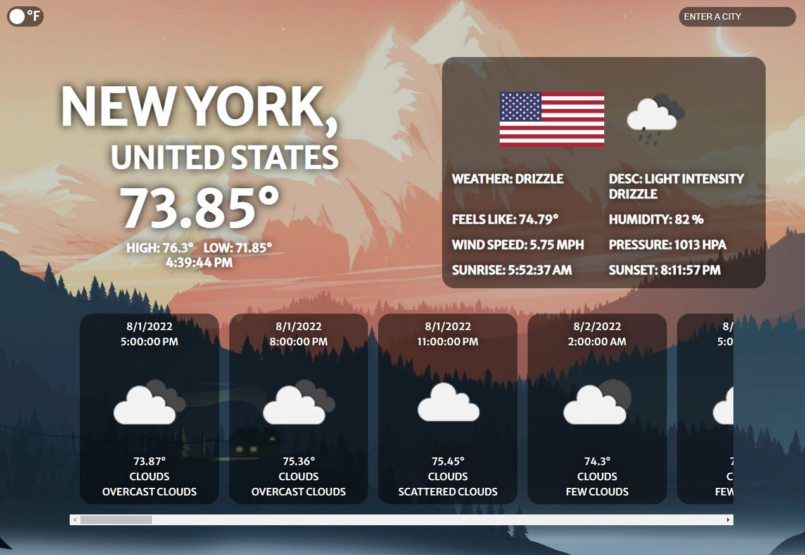

# Weather
> Simple express weather app
## Preview


## Built With
- Express and ejs view engine

## Deploy
```
git clone, install, and then npm start
```

## Link to Demo
[Demo](tianqiweather.herokuapp.com/)
